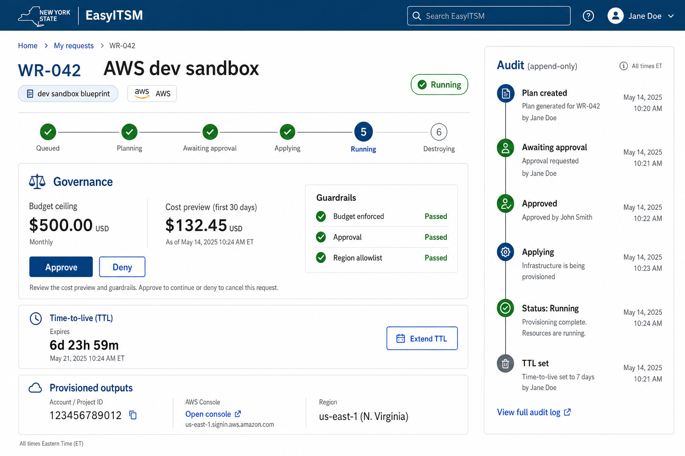
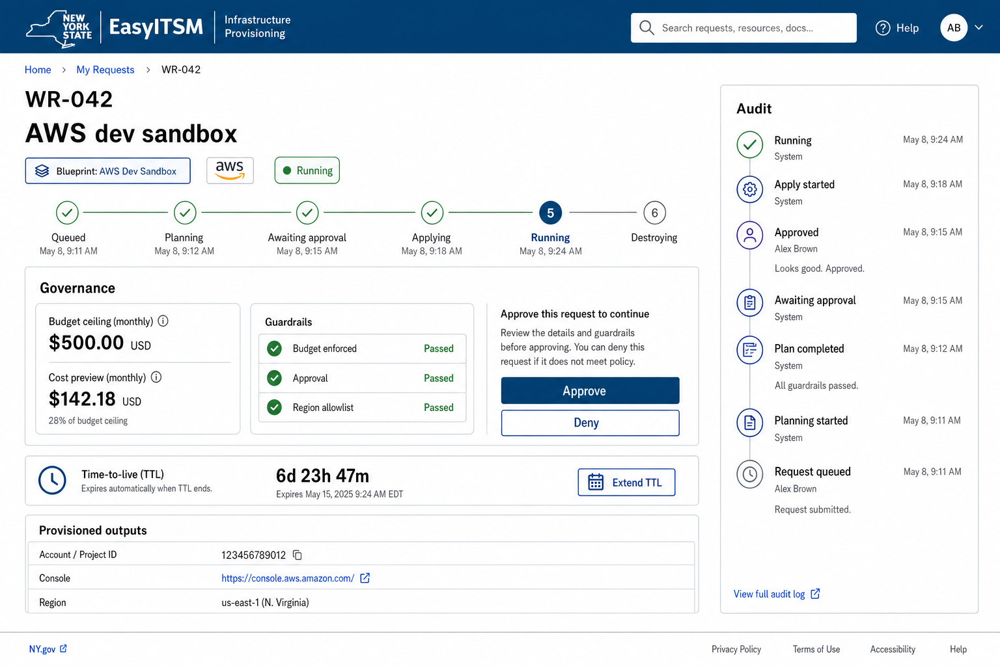
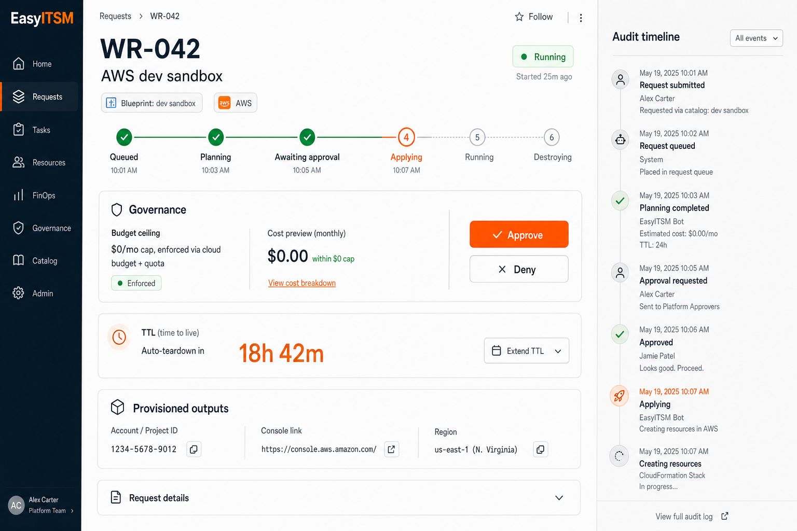

# FlowOps — Architecture & Design Document

**Status:** Plan approved (Eng + CEO + Design reviews cleared). Implementation in progress (durable jobs table shipped in v0.1.0.0, #5).
**Version:** 1.1 (v1 scope; gap-closure revision, 2026-06-10)
**Document owner:** Brian Duffy

---

## 1. Executive Summary

FlowOps is an open-source **governed self-service provisioning platform** — *the
governed actuation layer*. It lets a person request infrastructure, pass an approval and
cloud-enforced budget gate, and have it actually **built** — with controls (approval, budget, policy,
audit) that never come off, and with agents and automation able to do the work *inside*
the guardrails.

It begins as a refined work-intake Kanban proof of concept and grows into something
sharper: **AI-native ITSM**. ITSM's skeleton — `request → task → action`, cleanly
linked — is genuinely good. Its flesh — the human bureaucracy that fulfills every task —
is pure toil. ServiceNow won in 2005 because Remedy made you waste your life on
care-and-feeding. In 2026 the toil worth killing is the *human-in-every-step*
fulfillment. FlowOps keeps the elegant `request → task → action` model and makes a
task's fulfiller a human, an automation, or an AI agent — while governance stays
constant no matter who or what does the work.

The v1 wedge is **sandbox vending**: a developer (or AI) sandbox that is requested,
gated, provisioned, and auto-torn-down on a TTL — proving the whole governed-actuation
loop end to end. It lives in the unserved middle between ClickOps (manual, ungoverned,
doesn't scale) and full CI/CD pipelines (overkill, get in the way).

This document captures the objectives, the chosen approach, the engineering
architecture, the design system, and the strategy, as decided across five structured
reviews (product, engineering, strategy, design, and a gap-closure re-review).

---

## 2. Objectives

1. **Kill one unit of toil for real.** A non-author colleague requests a dev sandbox,
   it passes an approval + cloud-enforced budget gate, real infrastructure is
   provisioned and auto-torn-down on TTL — with a full audit trail — without anyone
   hand-running infrastructure-as-code.
2. **Make governance first-class, not bolted on.** Every fulfilled task is gated and
   audited. The controls are the product.
3. **Be genuinely open source and embeddable.** A single organization can run the
   complete governed-actuation loop for free; the platform is designed to be embedded
   in other internal platforms.
4. **Earn the right to the bigger vision.** Prove one concrete loop, then generalize
   to the agentic workflow engine and the embeddable actuation core.

### 2.1 Positioning

The category FlowOps claims is **"governed self-service provisioning — the governed
actuation layer."** The headline is governance + actuation as one loop ("a request
passes a gate and gets *built*, and the controls never come off"). The sandbox is the
concrete demo *under* the category; "AI-native ITSM" is the vision/roadmap narrative.

This matters because category sets the comparison set. Called a "sandbox tool," FlowOps
is a feature next to Backstage's scaffolder. Called "the governed actuation layer," it
defines a lane it can own.

### 2.2 Landscape

| Space | Examples | Why FlowOps is different |
|---|---|---|
| OSS ITSM | GLPI, Zammad, iTop, OTOBO, osTicket | Those track tickets. FlowOps *actuates* and governs. |
| IDP / platform | Backstage, Port, Cortex, Humanitec | Those are catalogs + scaffolding, often BYO-everything. FlowOps is a batteries-included **governed loop**. |
| Actuation | Crossplane, AWS Service Catalog, Spacelift, env0 | Those provision. FlowOps provisions *inside* gates with audit, as one loop. |
| Commercial ITSM | ServiceNow, Atlassian JSM | FlowOps is the AI-native, open-source reframe. |

The seam almost nobody owns is the *middle*: intake + governance + actuation as one
loop, where the gate, the budget check, the policy enforcement, and the provisioning are
the same system, and agents do the labor inside the guardrails.

### 2.3 Definition of done (v1)

The objectives become testable here. v1 is done when all of the following hold
(dimensions are committed now; exact numbers — X, N, Y — are fixed during the week-0
spike):

1. A non-author colleague requests a sandbox and gets a **usable** one (access link in
   hand — §4.9) within X minutes of approval.
2. N consecutive full lifecycles (request → gate → apply → TTL → destroy) leave **zero
   orphaned spend** after the reconcile sweep — including runs with injected mid-apply
   failures.
3. 100% of expired TTLs are destroyed within grace period + X, and every teardown ran
   all four guardrails (dry-run, grace period, owner notification, never-destroy check
   — §4.11).
4. Every state transition emits an audit event — verified by test, not by inspection.
5. `FLOWOPS_PROFILE=dev docker compose up` runs the complete loop on a clean laptop in
   ≤ Y minutes with zero cloud credentials.

---

## 3. Scope

### 3.1 In scope (v1)

The minimal loop that proves the thesis:

`request → task → action`, with one blueprint (**dev sandbox**), one gate set (approval
+ cloud-enforced budget), one real actuator (OpenTofu in a container job), TTL teardown,
and an append-only audit trail. Plus a **dev (local) execution profile** that runs the
entire loop on a laptop with zero cloud credentials (see §4.7).

### 3.2 Explicitly NOT in scope (v1)

| Deferred | Rationale |
|---|---|
| AI sandbox blueprint | Fast-follow (#2 blueprint); proves the actuator seam. Needs definition first. |
| Agent fulfiller | The emotional center of the project, deliberately deferred to protect credibility — v1 proves the *loop and gates*, not yet the thesis. |
| Plugin registry / Gate & Fulfiller interfaces | Extract on the second real instance, not before. |
| Live cost estimation (Infracost) | Cloud-enforced budget replaces it for v1. |
| Warm pool of pre-vended accounts | Perf optimization for when on-demand vending latency hurts. |
| Multi-tenancy, SSO, hosted runners | Commercial / open-core layer, post-v1. |
| LocalStack dev path (real OpenTofu vs emulated AWS) | Fast-follow to dev mode; v1 dev mode is Dummy-only (§4.7). |
| `local-docker` blueprint (usable local sandbox) | Fast-follow; lets dev mode build a real local container, not just a simulated handle. |
| Per-sandbox in-place upgrades (re-apply a new blueprint version) | Sandboxes are immutable + disposable in v1; destroy and re-vend (§4.6 versioning). |
| MCP server for the control-plane API | Ships with the agent fulfiller (fast-follow #1); the v1 API is agent-ready (§4.12) but not agent-packaged. |
| Multi-channel notifications (Slack, Teams, SMS) | v1 ships in-app + one configurable channel (§4.10). |
| Policy-engine gates (OPA / Cedar) | Post-v1 (§10); v1 gates stay concrete: approval + cloud-enforced budget. |

### 3.3 Honest tension

The most exciting part of the vision — agents doing the work inside the gates — is *not*
in v1. v1 proves the governance + actuation loop with human-approval + automation only.
This is the right call: it keeps the "it actually gets built" promise honest. The agent
fulfiller is fast-follow #1.

---

## 4. Architecture

### 4.1 System overview

```
                          CONTROL PLANE (your account)
  +---------------------------------------------------------------------+
  |  FastAPI  -- enqueue -->  Queue        -- trigger -->  Tofu Runner   |
  |  (intake,                 (SQS /                       (Fargate task/ |
  |   board,                   Pub-Sub)                     Cloud Run Job,|
  |   gates)                                                runs OpenTofu)|
  |     |                         ^                            |         |
  |     | writes/reads            | status callbacks           | reads   |
  |     v                         |                            v         |
  |  Postgres                     +------------------  Actuator interface |
  |   |- work_requests/tasks                           |- RealActuator   |
  |   |- jobs (state machine)                           +- DummyActuator  |
  |   |- blueprints (+availability)                         (dry-run)     |
  |   +- audit_events (append-only)                                       |
  |                                                    tofu STATE here ---+--> S3+Dynamo
  +-----------------------------------------------------------------------+    / GCS
                                      | assumes scoped role (OIDC, no static keys)
                                      v
                          +---------------------------+
                          |  SANDBOX = own AWS account |  <- teardown = delete account
                          |  / GCP project (per req)   |     (orphan-resistant)
                          +---------------------------+
```

### 4.2 Execution model — durable queue + serverless container job

`tofu apply` / `destroy` is a multi-minute operation that can fail halfway. A synchronous
HTTP handler cannot own it. FlowOps uses a **durable queue (SQS / Pub-Sub) feeding a
serverless container job** (AWS Fargate task / GCP Cloud Run Job) that runs OpenTofu.

- No 15-minute function ceiling; crash-safe via queue redelivery.
- A `jobs` table is the state machine. **One job path serves both apply and destroy.**
- Required mechanics: idempotency keys, per-sandbox locks, job leases, and
  "apply-succeeded-but-callback-failed" reconciliation.
- `status()` reads the jobs table — it is not a live cloud poll.

```
JOB STATE MACHINE (one path for apply AND destroy):
  queued -> planning -> awaiting_gate -> applying -> succeeded
              |              | (deny)        |           |
              v              v               v           v (ttl)
           failed         rejected       failed<--+   destroying -> destroyed
                                                  +-- reconcile / orphan-sweep
```

### 4.3 Isolation — account/project per sandbox

Each sandbox is its **own AWS account** (Organizations) or **GCP project**. The runner
assumes a scoped role via OIDC — no stored static keys.

- **Teardown = delete the account/project.** This makes the two scariest problems
  structurally safe: a failed apply or a missed orphan is recovered by deleting the
  whole account/project, not by hoping a tag-sweep caught everything.
- Orphan-*resistant*, not instant or perfect: AWS account closure has a ~90-day window,
  GCP project deletion a ~30-day recovery window, plus billing tails — design for the tail.
- **The closure tail counts against vending quota.** Closed-pending AWS accounts (that
  ~90-day window) still count toward the Organizations account quota, so steady-state
  vending can starve even when quota looks ample. The vending quota gauge (§5.6) tracks
  active + pending-close as one number with an alert threshold, and raising the account
  quota is a week-0 action, not a launch-day surprise.
- OpenTofu **state lives in the control-plane account**, encrypted, with secrets
  redacted and access isolated.

The first cloud was decided by the **week-0 spike** (issue #1, `infra/spike/`): both
clouds passed the inner loop (provision/destroy/failed-apply/orphan-detect) 4/4, so the
call rested on vending — and **GCP won**. Project-per-sandbox vending is roughly one API
call and scales to thousands; the AWS account factory (Organizations/OUs/SCPs/Control
Tower, ~10-account soft quota) is far heavier and risked becoming the product. **v1 is
GCP-first** (Workload Identity Federation, no static keys); AWS follows as a second cloud
via the `Actuator` seam (post-v1). Two spike lessons feed the build: the orphan detector
must **fail loud** (never report clean when it cannot query), and the production
reconciler queries via the provider SDK, not a `gcloud` shell-out (CLI auth ≠ ADC).

### 4.4 The Actuator seam (the only abstraction in v1)

```python
class Actuator(Protocol):
    def plan(self, intent: Intent) -> Preview: ...      # pre-flight: what + est. cost
    def apply(self, intent: Intent) -> Handle: ...      # returns state-locating handle
    def destroy(self, handle: Handle) -> Result: ...
    def status(self, handle: Handle) -> Status: ...
```

Two v1 implementations: `RealActuator` (the container job) and `DummyActuator` (dry-run).
The dummy is also the test double *and* the placeholder for not-yet-live capabilities —
it lets the whole loop be built, demoed, and tested before the cloud is wired. Capability
flags (`available | preview | dry-run-only`) let the UI build around absent features, but
absent capabilities are shown as absent/preview, never silently faked.

Gates (approval, budget) and `fulfiller_type` stay concrete — no plugin registry until a
real second instance forces the interface shape.

### 4.5 Budget gate — cloud-enforced, not declared

The budget gate is a **hard ceiling the cloud enforces**, not a user promise. At
provision time, FlowOps sets a real AWS Budget + SCP / GCP budget + quota + service
allowlist on the sandbox account. A declared "this fits under $X" is governance theater;
the cloud-enforced ceiling is the only real control — and it removes the need for live
cost estimation in v1.

**Latency honesty + breach behavior.** AWS Budgets data lags by hours — the *instant*
ceiling is the quota set + the SCP service allowlist; the Budget action is the backstop,
not the tripwire. And when a breach signal arrives, FlowOps observes it rather than
trusting the cloud to act silently: the sandbox is flagged `over_budget` in status, the
owner is notified (§4.10), an audit event is recorded, and an operator can trigger
accelerated teardown through the normal destroy path (§4.11). A budget breach is never a
silent death.

### 4.6 Domain model

`request -> task -> action`, kept thin (no ITSM ceremony — no SLAs, categories, queues).
The task *is* the provisioning job; the action *is* the actuator call. This keeps the
thesis structurally true so the agent-fulfiller future slots in without a rename.

| Entity | Key fields |
|---|---|
| `User` | `id, username, role(requester\|approver\|admin), groups[]` — local JWT auth (§4.8) |
| `Blueprint` | `id, version, type(dev\|ai), tofu_module_ref, budget_cap, ttl_hours, max_lifetime_hours, max_extensions, default_region, allowed_roles, availability` |
| `Task` | `fulfiller_type(human\|automation\|agent), gate_results[], actuator_handle, blueprint_version (pinned at apply), idempotency_key` |
| `Gate` | `type(approval\|budget), config, result(pass\|fail\|pending), decided_by, decided_at` |
| `ActuatorHandle` | `state_backend_ref, workspace, outputs{}, status` |
| `AuditEvent` | `type, actor, task_id, correlation_id, payload, ts` (append-only) |

**Blueprint versioning.** A task snapshots `(blueprint_version, tofu_module_ref,
provider-lockfile hash)` at apply time — immutable job inputs, made concrete. **Destroy
runs the pinned version that applied, never latest** (destroying with a drifted module is
how teardown breaks). Blueprint edits append a new version, never mutate (consistent with
SR1's admin-gated, audited curation); running sandboxes are unaffected, and in-place
upgrades are explicitly out of v1 scope (§3.2) — sandboxes are immutable and disposable.

### 4.7 Execution profiles — dev (local) mode

FlowOps runs in one of two **execution profiles**, selected by config
(`FLOWOPS_PROFILE=dev|cloud`). Everything *above* the actuator — the
`request → task → action` model, the job state machine, the gates, the audit trail, and
the entire UI — is identical across profiles. Only the substrate changes.

| Concern | `cloud` profile | `dev` profile (v1) |
|---|---|---|
| Actuator | `RealActuator` -> OpenTofu -> AWS/GCP | `DummyActuator` — simulated `plan/apply/destroy` with realistic state transitions and timing |
| Execution | managed queue (SQS/Pub-Sub) + serverless container job | local DB-backed queue + in-process worker |
| State | S3 + DynamoDB / GCS | local (Postgres / file) |
| Budget gate | cloud-enforced (Budget + SCP + quota) | **advisory**, rendered as "dev — not enforced" |
| Sandbox | its own AWS account / GCP project | simulated handle (no real infra) |
| Teardown | delete the account/project | simulated destroy |

**Goal:** `docker compose up` runs the complete loop — request, both gates, the full
job state machine, TTL teardown, and the audit trail — on a laptop with **zero cloud
credentials**. This is the contributor and out-of-the-box story, and it lets the entire
product (including the lifecycle UI) be built and demoed *before* the week-0 cloud spike
lands.

**Invariants that still hold in dev mode:**

- **Fail closed** applies in every profile (a missing cost preview still blocks approval).
- **Dev mode is always visibly dev** — a profile badge in the UI and an advisory-budget
  label, so a simulated budget can never be mistaken for an enforced one.
- The `DummyActuator` is the same code that serves as the test double, so dev mode and the
  test suite exercise one implementation.

**Deliberately NOT in v1 dev mode** (deferred — see "NOT in scope"): a LocalStack path
that runs *real* OpenTofu against emulated AWS, and a `local-docker` blueprint whose
sandbox is a usable local container. Both are natural fast-follows once the cloud loop is
proven; v1 dev mode is Dummy-only by design, to stay cheap.

### 4.8 Identity, roles & approval semantics

v1 authentication is the PoC's local JWT auth, ported (username/password → JWT session),
with SR5 enforced: no seeded credentials outside the `dev` profile. SSO/SAML/SCIM stay on
the commercial side (§7). Authorization is deliberately thin — a `role` column, not a
policy engine:

| Role | Can |
|---|---|
| `requester` | submit requests; view, extend, and destroy *own* sandboxes (within §4.11 limits) |
| `approver` | everything a requester can, plus decide approval gates they are authorized for |
| `admin` | everything, plus blueprint curation (SR1), user/role management, never-destroy flags |

- An approver is authorized per blueprint via `Blueprint.allowed_roles`; an unknown or
  unlisted role cannot approve — fail closed.
- **Self-approval is denied.** The requester of a task can never decide its own approval
  gate, even as an admin — separation of duties, enforced fail-closed.
- Requests pending approval **auto-expire** after a configurable number of days (§5.7)
  into `rejected`, audited — the board never accumulates zombie requests holding a gate
  open forever.
- Every role change and approval decision is an audit event with actor provenance.

### 4.9 Sandbox access delivery

A sandbox in its own account is useless until the requester can reach it — access
delivery is part of the loop, not an afterthought. The blueprint module creates a scoped
role *inside* the sandbox account whose trust policy names the requester's identity. On
`apply` success, FlowOps surfaces:

- a **federated console sign-in URL**, and
- **short-lived CLI credentials** (STS-style, minutes-to-hours TTL),

both shown **once, to the requester only**. Neither is persisted: not in Postgres, not in
audit payloads, not unredacted in OpenTofu state (§5.3 redaction rules apply). Re-issuing
access is a fresh, audited action — the `access_issued` event records who, when, and for
which sandbox, never the credential material. Static keys never exist on this path,
matching the OIDC-everywhere posture.

### 4.10 Notifications

The teardown guardrails (§4.11) and failure alerts require an owner-notification channel,
so v1 ships one — minimal but real:

- **In-app** (board banner + lifecycle view) is the **guaranteed** channel; it cannot be
  misconfigured away.
- **One configurable best-effort channel:** SMTP email *or* a single webhook URL (§5.7).
  Multi-channel (Slack/Teams/SMS) is post-v1 (§3.2).

The interaction with teardown is defined so a broken mail server can't become infinite
spend: the grace period is **time-based and starts regardless**; every notification
*attempt and its outcome* is audited; an undeliverable notification flags the event for
the operator but never blocks teardown forever. The `dev` profile notifies in-app/log
only.

### 4.11 TTL, extension & teardown policy

- TTL extension is gated like apply (SR7: owner-or-admin, always audited) **and
  bounded**: a sandbox may be extended at most `max_extensions` times and never past
  `max_lifetime_hours` (both per-blueprint — §4.6). An extension that would exceed either
  limit is denied — fail closed.
- **The never-destroy guard, defined.** Its primary job is structural: the teardown
  worker **refuses to destroy any account/project it cannot positively identify as a
  FlowOps-vended sandbox** (unparseable or unrecognized handle = DENY). The control plane
  and every non-vended account are protected by construction, not by configuration. On
  top of that, an admin can set an audited `never_destroy` flag on a specific sandbox
  (e.g., one under incident investigation); the TTL worker skips it and alerts instead of
  destroying.
- Every teardown runs all four guardrails: dry-run, grace period, owner notification
  (§4.10), never-destroy check.

### 4.12 API contract — agent-ready by construction

Fast-follow #1 makes an AI agent a fulfiller; v1's job is to make sure the API needs no
rework when that lands. This is contract hygiene on the existing REST surface — not a new
abstraction, and no agent-specific endpoints ship in v1:

- a published **OpenAPI contract** (FastAPI emits this for free);
- **idempotency keys on request creation** — the same key the jobs layer already
  requires, extended to the API edge, so a retried `POST` can never double-provision;
- **machine-readable gate denials**: a structured error code + which gate failed + a
  remediation field, never prose-only;
- status enums identical to the job state machine (§4.2) — no UI-only states;
- **correlation IDs** in every response, matching the audit stream.

An MCP server packaging this API ships *with* the agent fulfiller, not before (§3.2).

---

## 5. Engineering Considerations

### 5.1 Failure modes

| Failure | Covered by | Silent? |
|---|---|---|
| Mid-apply failure -> orphaned spend | account/project deletion + reconcile sweep + test | No — job->failed, owner alerted |
| Worker crash mid-apply -> double-apply | idempotency key + per-sandbox lock + redelivery test | No |
| Budget bypass -> runaway spend | cloud-enforced budget + SCP + quota (hard ceiling) | No — cloud blocks it; FlowOps surfaces the breach (§4.5) |
| Wrongful teardown -> data loss | grace period + owner notice + never-destroy guard + fail-closed | No |
| Missing cost/budget config | fail-closed (block apply) | No |
| Control-plane compromise | state encryption + secret redaction + access isolation | Residual risk — flagged, monitored |

**Global invariant: fail closed.** Every gate and the teardown guard default to DENY on
ambiguity — a missing cost estimate, an unknown role, an unparseable handle blocks, never
proceeds.

### 5.2 Testing strategy

Full failure-path coverage. The failure tests *shape* the job model — the state machine
and its failure tests are written first, before happy-path actuation. `DummyActuator`
drives fast, deterministic unit and integration tests with zero cloud credentials;
integration tests against real OpenTofu (a throwaway cloud project, or LocalStack as CI
scaffolding — distinct from the deferred LocalStack-as-dev-mode path in §3.2) cover state
locking and cloud-failure semantics the dummy cannot prove. Required tests include:
mid-apply failure + reconcile, crash redelivery (no double-apply), budget at/over/under
cap, missing-cost-preview = fail closed, teardown guardrails, and quota exhaustion.

### 5.3 Security & supply chain

- OIDC scoped-role assumption; bootstrap trust, per-account role creation,
  least-privilege policy, and revocation/rotation are part of the week-0 spike.
- Curated OpenTofu modules are pinned by ref, with a provider lockfile + checksums and a
  review policy. A "curated" module is still supply chain.
- Append-only audit with correlation IDs, actor-identity provenance, immutable job
  inputs, and redaction rules.

### 5.4 Tooling choices (boring by default)

OpenTofu (not Terraform — MPL licensing fits an OSS project), Python/FastAPI control
plane, Postgres, a managed queue, object-store state backend. Innovation tokens are
reserved for the agent-fulfiller layer, not the plumbing.

### 5.5 Distribution

AGPL-3.0 core in an OSS repo. `docker compose up` runs the **app** in minutes; the
**actuation** half requires guided cloud wiring (it cannot be zero-config). CI via GitHub
Actions builds/publishes container images on tag, with GitHub Releases for versioned
artifacts. A hosted/managed offering is deferred until after v1 delights a self-host user.

### 5.6 Operability & DR

FlowOps must be operable by the team that runs it. v1 *emits and documents*; dashboards
are post-v1.

- A `/healthz` endpoint, plus a metrics endpoint exposing **jobs by state, queue depth,
  and oldest-job age**. A stuck job is a lease that expired — the lease-expiry sweep from
  §4.2 *is* the stuck-job detector, surfaced as a metric rather than invented as new
  machinery.
- **Account-vending quota gauge:** active + pending-close accounts as one number, with an
  alert threshold (§4.3). The "log the cap" footgun, promoted to a metric so a silent
  throughput ceiling can't masquerade as "covered."
- **Backup/DR:** scheduled Postgres backups, and state-backend object versioning +
  object-lock — the same mechanism that gives SR3 its WORM audit mirror. Losing OpenTofu
  state is recoverable *because* teardown = delete-the-account: the destroy path never
  depends on state being intact.

### 5.7 Control-plane configuration & secrets

OIDC removes static *cloud* keys, but the control plane holds secrets of its own:
Postgres credentials, the JWT signing key, SMTP/webhook credentials. All are sourced from
environment / a secret manager — never the repo, never CI (per the CI/CD rules). The same
config home carries the operational knobs, each shipped with a conservative default — an
explicitly unset limit means the default applies, never "unlimited":

- the SR2 limits: per-user/per-org aggregate budget, request rate limit,
  concurrent-sandbox cap;
- the approval auto-expiry window (§4.8);
- the notification channel (§4.10);
- `FLOWOPS_PROFILE` (§4.7).

---

## 6. Design

### 6.1 Design system — NYS Design System (mandatory)

FlowOps targets a **New York State government** context. The UI conforms to the **NYS
Design System** (USWDS-derived) and is built on `--nys-color-*` design tokens (CSS custom
properties) so it is themeable:

| Token | Value | Use |
|---|---|---|
| `--nys-color-theme` | `#154973` | Primary state blue; active state, section accents |
| `--nys-color-link` / `--nys-color-focus` | `#004dd1` | Interactive, links, focus rings |
| `--nys-color-success` | `#1e752e` | Passed / healthy |
| `--nys-color-text` | `#1b1b1b` | Body text |
| `--nys-color-surface` | `#ffffff` | Page surface |
| Environment theme | `#233f2b` | Alternate theme |

The proof-of-concept's orange admin accent is **superseded by the NYS theme blue**.
Typography is an accessible government sans (Public Sans family), never `system-ui`.

**Accessibility is mandatory (WCAG 2.1 AA / Section 508):** visible focus rings, >=4.5:1
body contrast, 44px touch targets, full keyboard navigation, ARIA landmarks, and
screen-reader labels on the status pill and lifecycle stepper. Status is never conveyed
by color alone — color is always paired with icon + text.

### 6.2 Information architecture — sandbox lifecycle view

Reading order, by priority: (1) identity + current status; (2) the lifecycle stepper
(where is this, right now); (3) governance (budget ceiling + Guardrails + Approve/Deny);
(4) TTL countdown + Extend; (5) provisioned outputs; (6) append-only audit timeline.
Status legibility is the number-one job — never plain "Status: applying" text.

### 6.3 Approved mockup

The approved build reference for the sandbox lifecycle detail view (NYS Design System
palette, calm layout, per-event audit iconography, guardrails panel that makes "controls
never come off" literally visible):



An alternate top-navigation treatment of the same screen:



For contrast, an earlier exploration in the original proof-of-concept palette (orange
accent), before the NYS Design System constraint reshaped the direction:



### 6.4 Interaction-state coverage

| Surface | Loading | Empty | Error | Success | Partial |
|---|---|---|---|---|---|
| Board card | skeleton + "Queued…" | n/a | red pill "Apply failed" + View error | green "Running" + TTL chip | amber "Applying… {step}" |
| Lifecycle detail | stepper skeleton | n/a | failed step red, audit shows error, Retry/Destroy | full stepper, outputs, TTL ticking | mid-stepper pulsing, outputs hidden until Running |
| Gate approval | "Loading cost preview…" (Approve disabled) | n/a | "Cost preview unavailable — cannot approve" (fail-closed) | Approve enabled, cost + budget shown | read-only awaiting banner for non-approvers |
| Failure / expiry | — | — | mid-apply failure: red banner + orphan-reconcile + owner alert | clean teardown: "Destroyed" terminal state + final audit | TTL near-expiry: amber countdown + prominent Extend |

---

## 7. Strategy

| Decision | Choice |
|---|---|
| License | **AGPL-3.0 + commercial dual-license** (requires a CLA from day one) |
| Open-core line | **Generous core** — full single-org governed-actuation loop is OSS; sell multi-tenancy, SSO/SAML/SCIM, advanced policy, hosted runners, audit retention/compliance, support |
| Positioning | "Governed self-service provisioning — the governed actuation layer." Sandbox = demo; AI-native ITSM = vision narrative |

The AGPL + commercial structure monetizes proprietary embedding directly, which is why
the feature core can be generous: the OSS version is a complete production tool for one
organization, not a toy.

---

## 8. Build Plan

### 8.1 Parallel lanes

| Lane | Modules | Depends on |
|---|---|---|
| A — control plane | `api/`, `models/` (PoC port, domain model, jobs table) | — |
| B — actuation | `actuators/`, jobs worker, queue wiring | A's jobs table (Dummy path early; Real path needs C) |
| C — cloud factory (week-0 spike) | `infra/` (account/project vending, budget/SCP, OIDC trust) | — |

Launch A + C in parallel (C is the spike). B starts against `DummyActuator` immediately,
integrating the Real path when C lands. A and B share the `jobs` table — one owner
defines that schema first.

### 8.2 Sequenced tasks (highlights)

1. **Week-0 spike (blocking) — exit criteria, all five required:**
   - vend → apply → destroy → orphan-detect round trip proven on **both** GCP project
     and AWS account, with round-trip times recorded;
   - OIDC trust per SR4: exact subject + audience, split identities, no wildcards;
   - budget + SCP/quota verified to **actually block** an over-cap action (not just
     configured);
   - account/project quota headroom measured, including the closure tail (§4.3), and
     quota raises filed;
   - first cloud chosen, with the decision and rationale recorded.
2. Bring the PoC into the repo; module layout `api/ actuators/ gates/ jobs/ audit/ infra/`;
   port PoC auth into the §4.8 role model.
3. Jobs/state-machine table; queue + container-job runner.
4. Actuator interface + Dummy + Real; approval + cloud-enforced budget gate (with §4.8
   approval semantics).
5. TTL teardown via the same job path (with §4.11 limits + never-destroy guard);
   append-only audit.
6. Sandbox access delivery (§4.9) and the notification channel (§4.10).
7. Full failure-path test suite (written with the state machine).
8. Operability: healthz/metrics, quota gauge, backups (§5.6); config home (§5.7).
9. Licensing: `LICENSE` (AGPL-3.0), `COMMERCIAL.md`, CLA bot, documented open-core line.
10. Design: `DESIGN.md` (NYS token mapping), build the lifecycle view from the approved
    mockup, implement all interaction states, WCAG 2.1 AA pass.

---

## 8.5 Security Requirements (CSO threat model, 2026-06-09)

FlowOps holds cloud credentials, executes IaC, can delete cloud accounts, and enforces
spend — so these are build-blocking requirements, not hardening to add later. The plan
already defends well on OIDC (no static keys), account-per-sandbox isolation, fail-closed
gates, control-plane state isolation, and module pinning. The requirements below close the
gaps the threat model surfaced. (AGPL = attackers can read the source; assume zero
obscurity throughout.)

- **SR1 [P1] — Blueprints are an admin-curated catalog; users never supply OpenTofu.**
  The runner executes blueprint modules with a powerful cloud role. Module source is
  allow-listed (pinned repo refs only); creating/editing a blueprint is an admin-gated,
  audited action. Prevents arbitrary cloud execution by non-admins.
- **SR2 [P1] — Aggregate spend + concurrency limits (denial-of-wallet).** Per-sandbox
  budget is not enough. Enforce a per-user/per-org **aggregate budget**, a **rate limit**
  on requests, and a **cap on concurrent live sandboxes** — all fail-closed. Defaults and
  configuration home: §5.7.
- **SR3 [P2] — Tamper-evident audit.** Append-only is not enough; the audit *is* the
  product. Hash-chain audit events (each row signs the prior hash) and/or mirror to a
  WORM / object-lock sink so tampering is detectable. (Matters doubly for NYS compliance.)
- **SR4 [P2] — Split control-plane identities.** Separate the (org-level) account-vending
  identity from the per-sandbox provisioning identity; use tight OIDC trust conditions
  (exact subject + audience, no wildcards). Resolve in the week-0 spike.
- **SR5 [P2] — No default credentials outside the `dev` profile.** The PoC's seed-on-boot
  default admin (`admin/admin123` etc.) must never exist in a non-dev deployment; force an
  admin password set on first real boot.
- **SR6 [P2] — Sign the runner image.** SHA-pin GitHub Actions, sign images
  (cosign + SLSA provenance), restrict who can push release tags, and scope CI's OIDC so a
  compromised pipeline cannot reach prod cloud.
- **SR7 [P2] — Explicit authz on destroy/extend.** Teardown deletes accounts; gate the
  destroy and TTL-extend transitions like apply — owner-or-admin only, always audited.
  Extensions are additionally bounded by `max_extensions` / `max_lifetime_hours` (§4.11).

---

## 9. Open Risks

- **Control-plane blast radius:** state + secrets concentrate in the control plane.
  Mitigated (encryption, redaction, isolation — §5.3/§5.7), not eliminated — monitored
  via the §5.6 operability surface.
- **Account-factory weight:** the cloud factory could become the product before sandbox
  vending exists. The week-0 spike timeboxes and de-risks this; the §5.6 quota gauge
  keeps its throughput ceiling visible after launch.
- **"Out of the box" honesty:** the app runs out of the box; actuation requires guided
  cloud setup. Positioned as a batteries-included governed loop vs a BYO toolkit — a
  strength, framed honestly, not a retreat.

---

## 10. Roadmap (beyond v1)

Single source for what comes after the v1 loop; the README mirrors this table.

| Horizon | What |
|---|---|
| **Fast-follow #1** | **The agent fulfiller**: an AI agent as `fulfiller_type=agent`, doing the work inside *unchanged* gates — plus an MCP server packaging the §4.12 API. The emotional center of the thesis, deliberately sequenced second. |
| **Fast-follow** | AI sandbox blueprint (proves the actuator seam); LocalStack dev path (real OpenTofu against emulated AWS); `local-docker` blueprint (usable local sandbox). |
| **Later** | Policy-engine gates (OPA/Cedar); the second cloud (whichever the spike didn't pick); warm pool of pre-vended accounts; broader lifecycle gates (destroy/extend/budget-increase); the embeddable actuation core. |
| **Commercial** | Multi-tenancy, SSO/SAML/SCIM, hosted runners, audit retention / compliance evidence (§7). |

---

## Appendix A — Review Provenance

This plan was produced and pressure-tested across five structured reviews:

- **Product (office hours):** reframed work-intake PoC into AI-native ITSM / governed
  actuation; locked the sandbox wedge and "A + seam toward B" approach.
- **Engineering review:** locked execution model, isolation, the Actuator seam + dummy,
  and full failure-path testing. An independent cross-model pass (Codex, GPT-5.5) surfaced
  23 challenges — integrated or routed.
- **CEO / strategy review:** locked license (AGPL + commercial), the generous open-core
  line, and positioning.
- **Design review:** rated the new provisioning UI 3/10 -> 8/10; surfaced the NYS
  Design System + accessibility constraint; approved the lifecycle mockup; specified all
  interaction states.
- **Gap-closure review (v1.1, 2026-06-10):** independent re-review of the approved plan;
  closed 14 specification gaps without expanding v1 scope — identity/roles & approval
  semantics (§4.8), sandbox access delivery (§4.9), notifications (§4.10), TTL/extension
  limits + the never-destroy guard (§4.11), agent-ready API contract (§4.12), blueprint
  version pinning (§4.6), budget-breach behavior (§4.5), the closure-tail quota footgun
  (§4.3), operability & DR (§5.6), control-plane configuration (§5.7), a v1 definition
  of done (§2.3), week-0 spike exit criteria (§8.2), and a consolidated roadmap (§10).

All decisions were made by the project owner; cross-model input was advisory.
